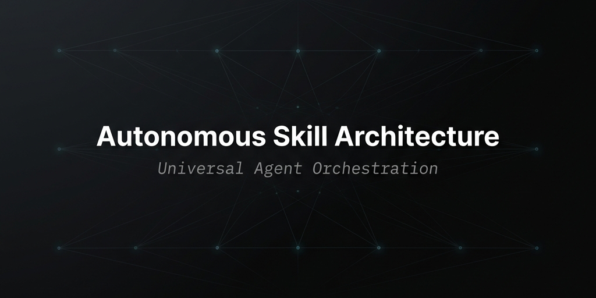

<div align="center">

# AUTONOMOUS SKILL ARCHITECTURE
<p align="center">
  <em>The universal orchestration layer for Claude Code, Cursor, Gemini CLI, Antigravity, and independent agent ecosystems.</em>
</p>

[](#)
[](#)
[](#)

<br>



</div>

<br><br><br>

## UNIVERSAL INTELLIGENCE

This repository is an OS-level orchestration layer designed to scale autonomous execution. It is built natively for modern agent environments (Cursor, Claude, Kiro, Antigravity) to serve **any agent ecosystem**.

Standard LLM workflows degrade when exposed to thousands of prompts. This architecture utilizes a strict 3-Tier indexing algorithm (Manifest → Category → Skill) to ensure surgical execution, zero token waste, and absolute routing reliability.

<br><br>

## THE CORE ARSENAL

The foundational primitives that power autonomous workflows.

<div align="center">

| THE ORCHESTRATOR | THE GUARDIAN | THE COMPRESSOR |
| :--- | :--- | :--- |
| **`master-skill`**<br><br>The authoritative control unit. Enforces a strict 7-phase execution pipeline, parses intent, manages memory, and executes the Plan-Apply-Unify (PAUL) loop. | **`defender-agent`**<br><br>The security perimeter. Actively hunts for vulnerabilities (SSRF, DoS bypasses) and enforces rigorous input validation and IP-pinning. | **`caveman`**<br><br>The token preserver. Eliminates LLM narrative bias. Enforces facts, fragments, and absolute compression, preserving context windows. |

| THE AUTOMATOR | THE OBSERVER | THE ARCHITECT |
| :--- | :--- | :--- |
| **`cicd-automation`**<br><br>Designs and deploys complex, multi-stage pipelines and rollout strategies across cloud providers with zero human intervention. | **`agent-memory`**<br><br>The persistent neural state. Logs architectural decisions, workflow states, and contextual anchors for precise cross-session recall. | **`cloud-architect`**<br><br>Synthesizes fault-tolerant, multi-cloud topologies. Drives cost-optimization and scalable infrastructure design patterns. |

</div>

<br><br><br>

## UNIVERSAL AGENT INTEGRATION

This library is agnostic. Whether you are using Antigravity, Claude, OpenAI wrappers, or custom terminal agents, the invocation syntax adapts to your environment.

### Core Invocation Patterns
Agent environments utilize command symbols or natural language to directly hook into the file system index.
```bash
# Example syntax across various tools
@master-skill
/defender-agent
Use brainstorming to plan a feature
```

### Skills — Tool × Local Skills Path × First Use

| Tool | Local Skills Path | First Use |
|:-----|:------------------|:----------|
| **Claude Code** | `.claude/skills/` or `~/.claude/skills/` | `>> /brainstorming help me plan a feature` |
| **Cursor** | `.cursor/skills/` (workspace-level) | `@brainstorming help me plan a feature` |
| **Gemini CLI** | `~/.gemini/skills/` | `Use brainstorming to plan a feature` |
| **Codex CLI** | `.codex/skills/` or `~/.codex/skills/` | `Use brainstorming to plan a feature` |
| **Antigravity IDE** | Global: `~/.gemini/antigravity/skills/` · Workspace: `.agent/skills/` | `Use @brainstorming to plan a feature` |
| **Antigravity CLI (agy)** | `~/.gemini/antigravity-cli/skills/` | `/brainstorming help me plan a feature` |
| **Kiro CLI** | Global: `~/.kiro/skills/` · Workspace: `.kiro/skills/` | `Use brainstorming to plan a feature` |
| **Kiro IDE** | Global: `~/.kiro/skills/` · Workspace: `.kiro/skills/` | `/skill-name` or `Use @brainstorming to plan a feature` |
| **GitHub Copilot** | N/A — paste skills or rules manually | `Ask Copilot to use brainstorming to plan a feature` |
| **OpenCode** | `.agents/skills/` | `opencode run @brainstorming help me plan a feature` |
| **AdaL CLI** | `.adal/skills/` | `Use brainstorming to plan a feature` |
| **Custom path** | `./my-skills` (any directory you choose via `--path`) | Depends on your tool |

---

## Notes

- **Default path (no flag):** `~/.agents/skills` (Antigravity 2.0 global). Older versions defaulted to `~/.gemini/antigravity/skills`.
- **Claude Code** also supports plugin marketplace install: `/plugin marketplace add sickn33/antigravity-awesome-skills`.
- **Cursor** uses workspace-relative `.cursor/skills/`, not a global home directory.
- **Antigravity IDE** has two paths — global (`~/.gemini/antigravity/skills/`) and workspace (`.agent/skills/`).
- **Antigravity CLI (agy)** reads flat markdown skills from `~/.gemini/antigravity-cli/skills/<skill>/SKILL.md`.
- **Kiro CLI / Kiro IDE** both support global (`~/.kiro/skills/`) and workspace (`.kiro/skills/`) paths. Skills load on-demand automatically.
- **GitHub Copilot** has no installer — manual copy-paste of skill content or rules is required (Text Only).
- **OpenCode** users should prefer a reduced install with `--category` / `--risk` / `--tags` filters to avoid context overload.
- **AdaL CLI** reads skills from `.adal/skills/` at startup.

<br><br><br>

## Universal Manual Clone (all tools)

```bash
# Default (Global)
git clone https://github.com/your-username/antigravity-skills.git ~/.agents/skills

# Claude Code
git clone https://github.com/your-username/antigravity-skills.git ~/.claude/skills

# Gemini CLI
git clone https://github.com/your-username/antigravity-skills.git ~/.gemini/skills

# Codex CLI
git clone https://github.com/your-username/antigravity-skills.git ~/.codex/skills

# Antigravity IDE (Global)
git clone https://github.com/your-username/antigravity-skills.git ~/.gemini/antigravity/skills

# Antigravity CLI (agy)
git clone https://github.com/your-username/antigravity-skills.git ~/.gemini/antigravity-cli/skills

# Kiro CLI / IDE
git clone https://github.com/your-username/antigravity-skills.git ~/.kiro/skills

# OpenCode
git clone https://github.com/your-username/antigravity-skills.git .agents/skills

# AdaL CLI
git clone https://github.com/your-username/antigravity-skills.git .adal/skills

# Cursor (Workspace)
git clone https://github.com/your-username/antigravity-skills.git .cursor/skills
```

### CLI Agents (Cursor, Aider, Cline)
Reference the physical markdown files directly in your terminal or chat panel commands.
```bash
> Apply the rules from @skills/cicd-automation/SKILL.md to build the deployment pipeline.
```

<br><br><br>

## SYSTEM INITIALIZATION

Deploy the routing architecture on your local hardware. Ensure you have cloned the repository into your preferred tool's path (as defined in the Universal Manual Clone section).

```bash
# Navigate to the target orchestration directory (example shown)
cd ~/.agents/skills

# Compile the 3-Tier Routing Matrix
python generate_indexes.py
```

<br><br><br>

## EXPANDING THE ARSENAL

To extend the agent's capabilities, forge a new skill and recompile the index.

**1. Scaffold the Directory**
```bash
mkdir semantic-routing
touch semantic-routing/SKILL.md
```

**2. Establish the Metadata**
```markdown
---
name: semantic-routing
description: "High-level description of execution boundaries and purpose."
keywords: ["routing", "llm", "semantic"]
---

# Execution Directives
- Implement boundary X.
- Restrict variable Y.
```

**3. Recompile the Index Matrix**
```bash
python generate_indexes.py
```

<br><br><br>

<div align="center">
  

The index is built. The pipeline is hardened. Initiate your first command.

</div>
